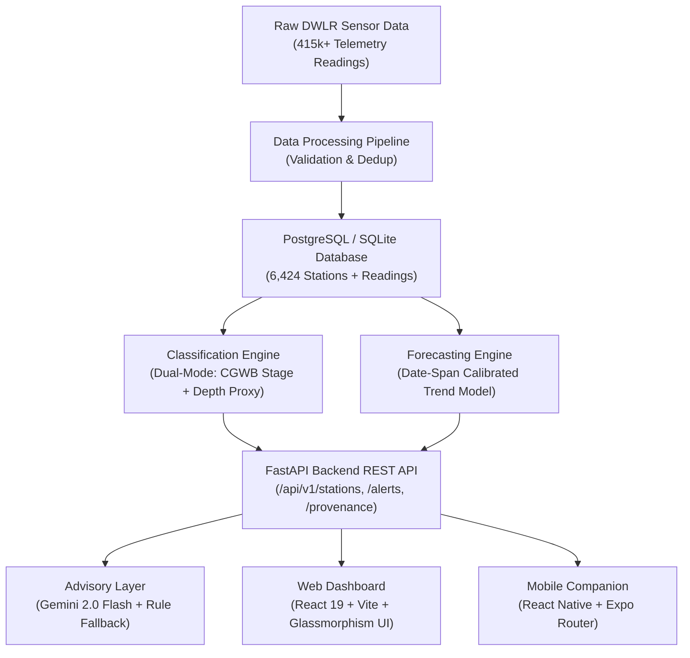

# JalDrishti (जलदृष्टि)

<p align="center">
  
</p>

<h1 align="center">JalDrishti — जलदृष्टि</h1>
<p align="center">
  <em>"Water Vision" — Real-time Groundwater Resource Evaluation & Advisory Platform using DWLR Telemetry</em>
</p>

<p align="center">
  
  
  
  
  
  
  
  
</p>

---

## 📖 Executive Summary

India relies heavily on groundwater for ~85% of rural drinking water and ~60% of agricultural irrigation. While the **Central Ground Water Board (CGWB)** monitors groundwater across ~25,000 **Digital Water Level Recorders (DWLRs)** nationwide, raw sensor telemetry has historically remained locked in static annual reports without continuous automated surveillance or predictive trend alerts.

**JalDrishti (जलदृष्टि)** closes this critical gap by providing an end-to-end continuous groundwater intelligence & decision-support system. It automatically ingests sensor telemetry, classifies station risks against statutory CGWB benchmarks, forecasts depletion trends using calibrated statistical models, and produces plain-language stakeholder advisories using **Google Gemini 2.0 LLM** with an automated deterministic fallback engine.

---

## 🌟 Key Capabilities

- **🛰️ Real-Time Telemetry Ingestion**: Scalable ingestion pipelines processing 415,000+ time-series water level depth observations across 6,400+ DWLR monitoring stations.
- **⚖️ Dual-Mode CGWB Risk Classification**:
  - **Statutory Benchmark**: *Stage of Groundwater Development (%)* (Annual extraction vs. net recharge ratio) for mapped assessment blocks (e.g., Mehsana, Jaipur, Nagpur).
  - **Continuous Telemetry Proxy**: Automated depth-below-ground-level (m bgl) categorization (*Safe < 8m, Semi-Critical 8–15m, Critical 15–25m, Over-Exploited > 25m*) to detect intra-year depletion spikes.
- **📈 Calibrated Trend Forecasting**:
  - Linear regression & rate-of-change modeling to project 24-month depletion trajectories.
  - **Statistical Confidence Rating**: Calibrated by actual sensor date-span duration (12+ months vs. short-term) and R² regression fit.
- **🤖 Transparent AI Advisory Engine (Google Gemini 2.0 Flash)**:
  - Plain-language situation assessments and actionable policy recommendations.
  - Transparent badges identifying **AI-Generated (Gemini 2.0)** vs. **Standard Advisory (Rule-Engine)** ensuring 100% uptime for local authorities.
- **🚨 Live Critical Transition Alert Feed**:
  - Automated detection when telemetry crosses statutory risk boundaries.
  - Multi-stakeholder dispatch audit (District Collector, Block Development Officer, Gram Panchayat Water Committee).
- **🛡️ Verified Data Provenance Panel**:
  - Live metadata panel on the dashboard linking directly to **India-WRIS** and official CGWB 2023 Dynamic Ground Water Resource reports.
- **📱 Cross-Platform Mobile Companion (React Native / Expo)**:
  - Dedicated mobile application in /mobile for field officers and district administrators.

---

## 🏗️ System Architecture



---

## 🛠️ Technology Stack

| Layer | Technologies |
|---|---|
| **Backend API** | Python 3.11+, FastAPI, SQLAlchemy, Pydantic v2, Uvicorn |
| **Data & Pipeline** | Pandas, NumPy (polyfit linear modeling), Celery, Redis |
| **Database** | PostgreSQL 16 / SQLite (async driver) |
| **AI / GenAI** | Google Gemini 2.0 Flash (google-genai SDK) |
| **Web Frontend** | React 19, TypeScript, Vite, Recharts, Leaflet GIS, Glassmorphism UI |
| **Mobile App** | React Native, Expo Router, TypeScript |
| **Testing** | Pytest, AnyIO, Pytest-AsyncIO (23 unit tests) |
| **DevOps** | Docker, Docker Compose |

---

## 🚀 Quick Start Guide

### Option A: Local Development Setup

#### 1. Clone the Repository
```bash
git clone https://github.com/Debddj/JalDrishti.git
cd JalDrishti
```

#### 2. Backend Setup (FastAPI)
```bash
cd server
python -m venv venv
```

**Windows (PowerShell):**
```powershell
.\venv\Scripts\activate
```

**Linux / macOS:**
```bash
source venv/bin/activate
```

```bash
pip install -e .
cp ../.env.example .env
```

*Configure .env with your settings (add GEMINI_API_KEY for AI advisories).*

Seed the database with 6,424 stations, 415k readings, and CGWB stage benchmarks:
```bash
python -m app.db.seed
```

Start the backend server:
```bash
uvicorn app.main:app --host 127.0.0.1 --port 8000 --reload
```
- **API Documentation (Swagger UI)**: http://127.0.0.1:8000/api/docs

#### 3. Web Client Setup (React + Vite)
```bash
cd ../client
npm install
npm run dev
```
- **Dashboard URL**: http://localhost:5173

#### 4. Mobile App Setup (React Native / Expo)
```bash
cd ../mobile
npm install
npx expo start
```
- Scan the QR code using **Expo Go** (Android/iOS) or press w for Web preview.

---

### Option B: Docker Compose Setup

```bash
cp .env.docker .env
docker compose up -d
```

---

## 🧪 Running Automated Tests

JalDrishti includes a 23-test suite covering risk classification, statistical forecasting, null-safety, and advisory fallbacks:

```bash
cd server
python -m pytest tests/ -v
```

```text
======================== 23 passed, 1 warning in 0.39s ========================
```

---

## 📊 Core API Endpoints

| Method | Endpoint | Description |
|---|---|---|
| GET | /api/v1/health | Service health status |
| GET | /api/v1/provenance | Verified dataset provenance, source citations, and coverage metrics |
| GET | /api/v1/stations | Paginated station registry with district & risk filtering |
| GET | /api/v1/stations/{id} | Full station telemetry observations & specifications |
| GET | /api/v1/stations/{id}/dual-classification | Side-by-side CGWB statutory stage vs. sensor depth proxy |
| GET | /api/v1/stations/{id}/forecast | 24-month trend projection with date-span calibrated confidence |
| GET | /api/v1/stations/{id}/advisory | Gemini 2.0 situation analysis & stakeholder recommendations |
| GET | /api/v1/alerts | Live critical risk transition notification feed |
| GET | /api/v1/districts | District-level aggregate risk summary |

---

## 🏛️ Government & Benchmark Data References

1. **Central Ground Water Board (CGWB)**: *Dynamic Ground Water Resources of India, 2023* — Ministry of Jal Shakti.
2. **India-WRIS**: *Water Resources Information System of India* — [indiawris.gov.in](https://indiawris.gov.in).
3. **National Water Informatics Centre (NWIC)**: Ground Water Telemetry Portal.

---

## 📜 License

This project is licensed under the MIT License — see the [LICENSE](LICENSE) file for details.

Developed for **Smart India Hackathon (SIH) 2025** · Problem Statement 068 · **Ministry of Jal Shakti**
